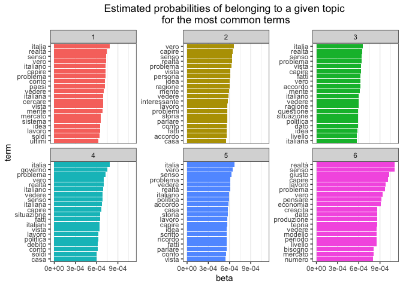

*Michele Boldrin* YouTube Channel: a general survey.
================
Andrea Ranzato
14/09/20

## Motivation

The following analysis was carried out to yield some insights on my
preferred YouTube channel: [*Michele
Boldrin*](https://www.youtube.com/channel/UCMOiTfbUXxUFqJJtCQGHrrA). In
addition, this small-scale project gave me the opportunity to experiment
with the YouTube API, JSON data structure, regular expressions and text
mining concepts. In fact, one of the final objectives was to identify by
means of the *Latent Dirichlet Allocation* (LDA) algorithm the main
topics covered in the channel analyzing the auto-generated video
transcripts and evaluating its effectiveness by comparing the results
with what is declared by Professor Boldrin in the [information
page](https://www.youtube.com/c/MicheleBoldrin-Videos/about) of the
channel.

## Description of the data

The following analysis used both quantitative data retrieved from the
YouTube API and text data consisting in the set of auto-generated video
transcripts of the over six-hundred videos existing on the channel which
were downloaded by means of the command-line program
[*youtube-dl*](http://ytdl-org.github.io/youtube-dl/). Unfortunately,
not all the videos had a text transcript, hence I decided to narrow the
analysis only on those for which one was available.

The features for each video of the channel obtained by having queried
the API are the following:

  - video title
  - video ID
  - number of views
  - number of likes
  - number of dislikes
  - number of comments
  - upload date and time
  - duration
  - video description
  - tags given by the author

A slice of the final data set is shown below.

| Video ID     |  Views | Likes | Comments | Dislikes | Duration (Min.) | Date       |
| :----------- | -----: | ----: | -------: | -------: | --------------: | :--------- |
| bOGK174KzS0  |  6.515 |   354 |       37 |       12 |             114 | 2020-09-04 |
| q4bqErx4rK0  |  2.818 |   139 |        6 |        6 |              54 | 2020-09-03 |
| D2TB-faSPu8  |  4.637 |   215 |        3 |        6 |             196 | 2020-09-03 |
| osk6wV\_IAZA |  4.990 |   295 |       31 |        7 |             158 | 2020-09-02 |
| H0A60t65EGA  |  6.922 |   330 |       19 |        7 |              69 | 2020-08-29 |
| PO1GOVB7Ye4  | 12.574 |   660 |      239 |       22 |             195 | 2020-08-27 |

Sample of the data set.

Alongside the data coming from the API, each video transcripts, once
downloaded, appeared almost unreadable as we can see in the excerpt
below. In addition, as illustrated in the book [*Text Mining with
R*](https://www.tidytextmining.com), before undergoing any sort of text
analysis, each transcript should be initially arranged in a tidy text
format which is a data structure defined as a table with *one token per
row*. Each token consists of units of text, usually one or two words,
that represent the data points of interest for the analysis.

    ##  [1] "WEBVTT"                                                                                                                                                                                
    ##  [2] "Kind: captions"                                                                                                                                                                        
    ##  [3] "Language: it"                                                                                                                                                                          
    ##  [4] ""                                                                                                                                                                                      
    ##  [5] "00:00:00.000 --> 00:00:03.940 align:start position:0%"                                                                                                                                 
    ##  [6] " "                                                                                                                                                                                     
    ##  [7] "in<00:00:00.630><c> questo</c><00:00:00.900><c> panel</c><00:00:01.260><c> che</c><00:00:01.469><c> si</c><00:00:01.680><c> vuole</c><00:00:01.829><c> mmt</c><00:00:02.310><c> su</c>"
    ##  [8] ""                                                                                                                                                                                      
    ##  [9] "00:00:03.940 --> 00:00:03.950 align:start position:0%"                                                                                                                                 
    ## [10] "in questo panel che si vuole mmt su"

Eventually, thanks to regular expressions and the **purrr** package,
each transcripts looked like the following fragment which was later
transformed in a tidy format.

    ##  [1] "in questo panel che si vuole mmt su altre diciamo così teorie monetarie"              
    ##  [2] "opinabili diciamo così abbiamo tre grandi esperti che sono tommaso monacelli "        
    ##  [3] "professore lippi il professor favero che sono qui e professore anche tu sai "         
    ##  [4] "perché no toc tommaso sempre che ho appena elevato la chiavetta scusate che "         
    ##  [5] "una cosa strana e quindi per me tu siamo due ultrà delinter per cui per questo "      
    ##  [6] "per quello che ho mi sono preso questa confidenza non dovuta ma ovviamente "          
    ##  [7] "professore anche tommaso e si sono divisi i compiti per parlare un pochettino "       
    ##  [8] "di tutte le fake news che girano sulla moneta come diciamo oggetto trauma tour "      
    ##  [9] "gico che tutto guarisce diciamo così o che è causa di tutte le malattie dal dalaltra "
    ## [10] "parte e quindi ci do volentieri a loro la parola perché sicuramente sono persone"

| Video Title                                                          | Term      | Document |
| :------------------------------------------------------------------- | :-------- | -------: |
| ‘Monetizzare è facile, come spararsi eroina in vena’. MMT e paraggi. | panel     |        1 |
| ‘Monetizzare è facile, come spararsi eroina in vena’. MMT e paraggi. | mmt       |        1 |
| ‘Monetizzare è facile, come spararsi eroina in vena’. MMT e paraggi. | teorie    |        1 |
| ‘Monetizzare è facile, come spararsi eroina in vena’. MMT e paraggi. | monetarie |        1 |
| ‘Monetizzare è facile, come spararsi eroina in vena’. MMT e paraggi. | opinabili |        1 |
| ‘Monetizzare è facile, come spararsi eroina in vena’. MMT e paraggi. | grandi    |        1 |

Tidy data set after having removed the stop words.

## LDA on text transcripts

After having transformed the scripts in a tidy format, the data set is
ready to be given as input to the LDA algorithm which is guided by two
principles:

1.  Every document is made up of a mixture of topics
2.  Every topic is characterized by a mixture of words

Finally, we can verify if the algorithm has done a good job in
approximating the macro topics that are mentioned in the information
page of the channel by Professor Boldrin which are:

  - economics
  - history
  - politics
  - philosophy
  - psychiatry
  - literature

First of all, given the results summarized in the picture above, we see
that there is room for interpretation in discriminating the different
topics due to a prevalence of nouns that have general meaning and are
present across the six topics, such as “realtà”, “fatti”, “senso”,
“vero”, “capire”, “mente”, “problema” and “cercare”. Indeed, those
who are familiar with the channel may not find this fact astonishing
since the leitmotif of the channel, whatever the topic, is, indubitably,
the quest for truth by always sticking to the facts and reality.

However, although the boundaries among the groups seems not to be well
defined, I would still relate with confidence topic number 6 to
“economics” due to the presence of words, such as “economia”,
“crescita”, “mercato”, “produzione”, “numero”, “lavoro”, “modello”,
and “dato” which, in addition, exhibit higher probabilities of belonging
to this topics compared to the others.

Topic number 3 may represents the macro topic of “Italian politics”,
with group 4 and 5 being its subtopics. I suggest the former to be
“governance of Italian public budget” given the words “debito”,
“soldi”, “governo”, “italia”, “conto”, whereas the latter related to
the history of Italian politics as a consequence of “storia”,
“politica”, “ricordo”, “accordo”.

The remaining two are not immediately identifiable since they seem
correlated with the ones mentioned above.
